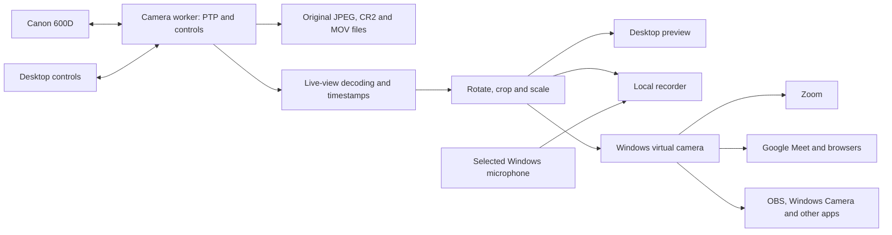

# Open-source Canon 600D utility — development plan

Prepared September 10, 2026. This is the approved design baseline. Development has started; see README.md and docs/hardware-validation.md for implemented and verified behavior. The milestones below remain acceptance targets, not a claim that they are complete.

**Outcome**

Deliver a Windows desktop application that connects to the EOS 600D/T3i, provides the camera controls it actually supports, captures original full-resolution photos, and exposes a standard selectable Windows virtual camera. Zoom, Google Meet, browser camera APIs, OBS, Windows Camera and other camera-consuming applications are first-class targets. Publish the application source, build instructions, and an installable release that works without Canon Webcam Utility, Canon EDSDK, or OBS.

The virtual camera is a core product component. A dedicated OBS plugin is optional and must never be required to use the camera in another application. Full-resolution capture and advanced camera controls remain available in the companion desktop application; third-party applications receive video through their ordinary camera selection workflow.

**Target environment and assumptions**

The development machine was checked again for this plan: Windows 11 Home, version 10.0.26200, 64-bit, AMD Ryzen 7 5700G. Build Windows x64 binaries and test first on this exact OS build. OBS Studio 32.0.2 was found during the earlier inventory; record the installed version again when integration testing starts. Other Windows builds are additional compatibility targets, not an initial promise. Windows 10, ARM64, macOS, Linux, and multiple simultaneous cameras are later work.

Use one physical 600D over its Mini-B USB connection, initially with stock firmware. Firmware version, fitted lens, power supply, and physical USB driver binding still need to be recorded. Home edition is sufficient for the proposed desktop architecture; a Linux subsystem or virtual machine is not a product prerequisite.

Full-resolution stills and live video are separate requirements: preserve the camera's original 5184 × 3456 JPEG/CR2 captures, while measuring the actual preview resolution. The documented 1056 × 704 USB live view is a baseline, not a native-1080p promise. [Canon specifications](https://asia.canon/en/support/6200098100), [Dragonframe 600D support](https://www.dragonframe.com/camera-setup/canon_eos_600d/)

**Architecture decision**

Use a Rust application/core with a native egui/eframe interface. Access Windows APIs through Microsoft's Rust bindings. Use small C++ adapters for Windows virtual-camera integration where their sample code and interfaces make that simpler. Pin compiler and dependency versions at project setup. These are proposed engineering choices, not an existing implementation. [egui/eframe](https://github.com/emilk/egui), [Rust for Windows](https://github.com/microsoft/windows-rs)

First test Windows Portable Devices vendor-command access to the camera's PTP operations. WPD manages its transport session; our application must use the appropriate vendor-command API rather than mixing raw USB containers into that path. If the physical device's Windows binding cannot support this approach, or sustained preview proves inadequate, use a WinUSB transport through nusb. That fallback needs a documented device-specific driver installation and restoration path. [WPD vendor extensions](https://learn.microsoft.com/en-us/windows/win32/wpd_sdk/supporting-mtp-extensions), [nusb](https://github.com/kevinmehall/nusb), [Windows USB backend considerations](https://github.com/libusb/libusb/wiki/Windows)

libgphoto2 remains the main protocol reference. Its upstream documentation explicitly says Windows is not supported, so do not make a native libgphoto2 build the critical dependency. Consult and reuse its EOS implementation under the applicable license; do not spend the first milestone porting its entire platform layer. [Upstream platform statement](https://github.com/gphoto/libgphoto2/blob/master/README.md), [EOS implementation](https://github.com/gphoto/libgphoto2/tree/5672d510447bed26aa4c5d646665e768281bc680/camlibs/ptp2)

Run the camera worker as an ordinary per-user process, started on demand. It owns the USB connection, events and command queue. Desktop UI, local recorder and virtual-camera adapters use this worker; none opens a competing camera session. Use versioned local named pipes for control and bounded shared-memory buffers for video. Authorize IPC for the intended user and the verified Windows Frame Server hosting identity as necessary; test this boundary during the early virtual-camera proof. Do not expose a network server or run an always-on privileged application service.

Use Windows 11 Media Foundation virtual-camera APIs as the initial adapter. Prove actual client compatibility rather than assuming registration guarantees it. If a required client uses a path this adapter cannot satisfy, implement a DirectShow capture filter for that path using the same worker. A client-specific OBS plugin does not count as fixing general camera compatibility. Manage naming and registration so users can identify the correct device without confusing duplicate entries. [Microsoft virtual-camera sample](https://github.com/microsoft/Windows-Camera/blob/master/Samples/VirtualCamera/README.md), [Virtual-camera API](https://learn.microsoft.com/en-us/windows/win32/api/mfvirtualcamera/nf-mfvirtualcamera-mfcreatevirtualcamera)

Original media transfers bypass all preview transforms. Live frames use one processing path so the desktop, recorder and external applications receive consistent rotation and framing. Start with BGRA frames and a proven JPEG decoder; introduce GPU processing or alternative pixel formats only when measurements justify them.

**Milestones, in implementation order**

| Milestone | Concrete deliverable | Completion condition |
|---|---|---|
| 0. Camera and virtual-device proof | USB diagnostic prototype plus a synthetic Windows virtual camera | Open native Windows path retrieves frames/photos; Zoom, Meet/browser and OBS can select and display the synthetic camera without OBS acting as a bridge |
| 1. Reliable camera core | Session state machine, serialized commands, event handling, file transfer, diagnostics | Repeated connection and capture work; disconnects and timeouts do not corrupt files or duplicate shutter actions |
| 2. Tethering controls | Desktop preview, shutter, focus, exposure controls, original-photo browser | Core controls verified on the actual camera/lens; original JPEG and CR2 preserved; unsupported actions clearly identified |
| 3. General virtual-camera alpha | Real-camera frames, transforms, format negotiation and camera registration | Zoom, Meet in Chrome/Edge, browser capture, OBS and Windows Camera consume correctly oriented video through camera selection |
| 4. Modes and camera movie workflow | Tested mode-control matrix, camera recording controls where supported, MOV transfer | Every requested mode action has a measured outcome and usable fallback; transferred movies match originals |
| 5. Recording and compatibility beta | Local PC recording with audio, multiple-consumer operation and compatibility hardening | Local recordings and the required client matrix pass on build 26200 |
| 6. Reliability and open-source release | Installer, automated checks, hardware test results, source and documentation package | Clean installation, two-hour session test, recovery checks and dependency/license review pass |
| 7. Camera-side extensions | Findings and optional implementation for unresolved capabilities | Each extension has a reproducible benefit and documented firmware requirements; core app remains usable without it |

The first usable release for camera applications is milestone 3. The complete first release includes milestones 0–6. A dedicated OBS plugin is a possible later convenience, outside the critical path. Milestone 7 remains part of the roadmap for capabilities the stock camera cannot expose; it is not allowed to silently become an unmet prerequisite for ordinary use.

**0 — Prove access before building the product**

Inventory physical USB identity and binding, firmware, lens model, lens AF/MF position, shooting mode and power. Distinguish the physical camera from Canon's virtual webcam. Record the condition of the existing setup so transport experiments can be reversed.

Implement a narrow diagnostics program: enumerate, connect, query supported operations/properties, enable live view, save an unmodified preview frame, trigger one photo and download its original file. Try WPD first. If that fails, capture targeted exchanges from a working application or test WinUSB access. Existing Canon applications may need to release the camera; do not terminate unrelated processes.

Measure the frame dimensions and useful picture area in photo/movie modes, actual delivered frame rate, live-view latency, and behavior during a still capture. Inspect whether orientation is available. Start with a 10-minute preview run and several JPEG/RAW captures; retain settings and results. No higher preview resolution is advertised until observed.

Also build a minimal virtual-camera adapter using an animated, labeled test pattern. Verify discovery, opening, frame delivery and closing in Zoom, Google Meet/browser capture and OBS. This test does not depend on physical-camera access and isolates Windows camera presentation from Canon protocol problems. Confirm actual media-source hosting identity, IPC access, camera privacy permissions and registration lifetime. Use local previews or self-tests; do not join or transmit to other people's meetings as part of a test without authorization.

Exit with one selected USB transport and a proven virtual-device path for the required client APIs. If only EDSDK succeeds, report that as an unresolved open-distribution requirement and continue investigating the open path before committing to a polished UI. A port of libgphoto2 is a fallback research project, not an assumed fix.

**1 — Camera core and data contracts**

Use explicit disconnected, connecting, ready, previewing, capturing, transferring, camera-recording, and recovering states. Model permitted transitions and stream interruptions. Serialize PTP requests per device, service events and keepalive, use bounded retries for busy/not-ready responses, and cancel cleanly on unplug.

Never blindly retry a timed-out shutter or recording-start command: the camera may already have acted. Reconcile events and camera state first, then report an uncertain result if necessary. Validate response lengths and property types before parsing or applying values.

Define these stable interfaces:

| Contract | Required information |
|---|---|
| Device identity | Model, firmware, transport, connection-generation ID; serial kept local by default |
| Capability | Control ID, data type, current value, allowed values/range, writable/read-only/unavailable/unsupported state, reason |
| Command/result | Request ID, expected connection generation, parameters, result and camera error; distinguish accepted from completed |
| Event | Property change, frame, capture completion, object available, transfer progress, disconnect and fault |
| Frame | Sequence, monotonic host timestamp, source dimensions, pixel format/stride, output dimensions and applied transform |
| Capture asset | Camera object identity, original format/name, byte count, local path, transfer status and optional pair/group ID |

Write transfers to temporary files and finalize only after expected-length and format validation. Never overwrite an existing photo or delete the camera copy by default. Group RAW+JPEG pairs. Keep local settings/presets in versioned configuration files; use a small session manifest rather than a database server. Redact personal paths and serials from exported diagnostics; image data is opt-in.

**2 — Full-resolution tethering interface**

Build a large preview, a compact camera-control panel and a capture strip. Provide shutter, autofocus/cancel, and three near/far focus increments. Expose ISO, shutter, aperture and white balance first; add exposure compensation, metering, drive mode, picture style, image quality and destination when supported. Refresh values when changed on the physical camera.

Capabilities drive the UI. Explain when a control requires Manual mode, an autofocus lens or a different AF/MF switch position. Focus steps are relative motor movements, not guaranteed distances. One-shot AF does not imply continuous subject tracking. Attempt focus-area selection only after support is established; map preview clicks back through rotation, scaling and cropping to camera coordinates.

Download full originals and offer fit-to-window/100% photo viewing. Use an embedded preview for CR2 display where practical while preserving the original CR2 bytes. Full RAW development and editing are outside the first release. A triggered still may interrupt live view; report the interruption and recover the feed rather than promising seamless simultaneous capture.

Exit after a hardware run covering JPEG, RAW and RAW+JPEG, changing controls from both UI and camera, manual-lens/AF restrictions, and interruption recovery. Record unsupported controls in the compatibility matrix rather than presenting nonfunctional buttons.

**3 — Portrait, landscape and a general Windows virtual camera**

Provide rotation at 0/90/180/270 degrees, optional mirroring, explicit crop, fit/fill and aspect-preserving scaling. Start with user-controlled rotation. Automatic rotation is enabled only when a verified sensor/event source exists. Do not automatically classify dark scene edges as removable borders.

Offer native-size output, 1920 × 1080 landscape and 1080 × 1920 portrait, plus lower-resolution presets. Display original and output resolution and identify upscaling. Keep output dimensions fixed during a recording; changing presets requires stopping or starting a new file. An orientation change within the fixed frame is a separate transform choice.

Connect the milestone-0 virtual device to processed camera frames. Let clients request supported resolutions, pixel formats and frame rates; negotiate and convert output accordingly. Keep native camera rate separate from advertised output cadence, identify duplicated frames in diagnostics, and never report synthetic frame repetition as increased camera detail or capture rate. Handle multiple consumers with independent output-format requirements and bounded buffers while retaining one camera session.

Use the companion app to set lens focus, autofocus, exposure, shutter actions, rotation and framing; clients need only select the virtual camera. Map standard camera-control requests to actual capabilities where feasible, and define which controller owns autofocus/exposure so a meeting client cannot silently fight the user's settings. Do not require Zoom or a browser to expose every Canon control.

Support native portrait formats where clients accept them and a compatibility landscape canvas with the upright portrait image fitted inside where needed. Client applications may crop, scale, mirror their self-preview, or renegotiate dimensions; distinguish those actions from our delivered pixels. Verify the encoded or received image, not just a mirrored self-preview. The utility cannot force a conferencing service to deliver full resolution or a portrait layout end to end.

The required client matrix is:

| Client | Required checks |
|---|---|
| Zoom desktop | Listed in camera picker; opens, stops/restarts and receives upright video; test local preview and negotiated format |
| Google Meet in Chrome and Edge | Camera picker, site permissions, pre-join preview, portrait framing and recovery after camera switching |
| Browser camera API in Chrome, Edge and Firefox | Device enumeration after permission, getUserMedia constraints, actual track settings, stop/reacquire and local capture |
| OBS | Standard Video Capture Device path; no custom source plugin required; saved portrait/landscape frames checked |
| Windows Camera | Device selection, preview and supported photo/video capture behavior |
| Concurrent clients | Zoom plus browser and OBS plus browser; no conflicting USB sessions or growing latency |

Record exact client versions on build 26200. Other camera applications inherit the standard interface but are listed as untested until checked. Compatibility is a release requirement, not a promise that every application accepts every format.

Acceptance: the client matrix passes and two saved test videos, portrait and landscape, show the correct orientation when decoded without depending on rotation metadata. Check actual file dimensions, text legibility/mirroring, framing, and pixel aspect ratio. Verify client restarts, switching away/back, camera-off placeholder, and the desktop UI opening or closing while the worker continues serving clients. Slow consumers must drop stale preview frames rather than grow an unlimited queue. The utility's private capture path retains full-resolution originals; snapshots taken by third-party apps are limited to the virtual-camera frame they request.

**4 — Shooting modes and camera-side movies**

Test P/Av/Tv/M selection separately from still/movie switching, live-view enablement, drive mode, and AF mode. Query read/write access, attempt only valid advertised changes, observe confirmation, and document required physical-dial positions. Do not confuse a readable mode property with a writable one.

Where supported, add internal movie start/stop, elapsed time and original MOV download after recording. Distinguish this prominently from PC recording. Report SD-card, space, mode and recording-state constraints. Verify whether USB preview survives movie recording and whether still capture is allowed in that state.

Exit with a definitive supported/unsupported/unresolved result for each mode request. Unsupported stock controls receive a documented physical action or a milestone-7 investigation. No claim of complete remote dial control is made until demonstrated.

**5 — Standalone recording and compatibility hardening**

Add local PC recording using Windows Media Foundation, initially H.264 video in MP4 with a selected Windows audio input. Confirm encoder availability and software fallback on this machine before relying on GPU-specific acceleration. Timestamp video and audio against a consistent clock and provide a measured sync adjustment. Clearly separate live recording quality from original camera MOV quality. [Media Foundation encoding](https://learn.microsoft.com/en-us/windows/win32/medfound/tutorial--using-the-sink-writer-to-encode-video)

Handle orderly file finalization, disk-full conditions and application shutdown. Use temporary filenames during recording, periodic file segmentation for long sessions, and preserve interrupted files with an explicit incomplete status. Do not advertise crash-proof MP4 files without validation.

Harden the existing virtual camera: on-demand worker startup, tray/minimized operation, multiple-client requests, last-consumer shutdown behavior, unplug/replug, camera privacy permission changes, sleep/resume, installation upgrades and clean removal. If the required client matrix identifies an API compatibility gap, complete the DirectShow adapter before calling the general-camera beta ready. Test relevant client bitness and packaging requirements rather than assuming an x64 DLL can load in every consumer process.

Acceptance: record a portrait and landscape clip directly in the app with synchronized audio; compare framing with the virtual-camera output; connect multiple camera consumers without opening multiple PTP sessions. Inspect a clap test at the start and end of a long recording for drift. Meeting applications continue using the user's selected microphone; a virtual audio device is not required for the camera to work.

**6 — Verification and public release**

Automate meaningful tests: malformed/truncated PTP data, unexpected events, command timeouts with uncertain outcomes, original-file integrity, RAW+JPEG grouping, orientation and crop-coordinate transforms, IPC version mismatch, and recovery after worker failure. Use synthetic frames and permitted/redacted protocol fixtures so contributors can run tests without a camera. CI verifies Windows builds, linting, tests, dependency notices and packaging; it cannot replace hardware testing.

Hardware release criteria on the target machine:

- Two-hour powered recording/preview session with stable memory after warm-up, no progressive delay, and no unrecovered disconnects; log actual frame rate and dropped frames.
- At least 20 connect/disconnect cycles and 50 mixed JPEG/RAW/RAW+JPEG capture operations, with complete files and no unintended duplicate shots.
- Disk-full, unavailable output folder, camera busy, lens restrictions, card removal, sleep/resume, USB loss, and cancelled-transfer behavior documented and tested where applicable.
- End-to-end portrait/landscape recordings inspected independently of the UI, plus the Zoom/Meet/browser/OBS/Windows Camera matrix. Measure latency and audio drift; publish results rather than promising 30/60 fps unsupported by the camera. Ordinary use must work with OBS absent.
- Clean install/uninstall under a normal Windows user on build 26200, with every required elevation explained. If WinUSB is required, target only the identified camera and verify restoring its former binding.

Proposed performance budget: keep processing-added latency below 50 ms at the measured native preview rate, use a small fixed frame ring, and prevent memory growth during the two-hour session. Treat these as acceptance targets to tune from milestone-0 evidence. They are not camera performance claims.

Prepare the repository from the first implementation milestone with source, tests, architecture decisions, protocol notes, dependency versions, contribution guidance, model/firmware/lens matrix, issue templates and build instructions. Proposed application license: GPL-3.0-or-later, subject to a component-level compatibility check; retain each dependency's actual notices and terms. Reused libgphoto2 code retains its applicable obligations. No Canon SDK binaries, proprietary headers or firmware dumps enter the default distribution. Open source permits others to modify and redistribute under the selected license; it does not prohibit charging for distribution. [GPL terms](https://www.gnu.org/licenses/gpl-3.0.html), [libgphoto2 license](https://github.com/gphoto/libgphoto2/blob/master/COPYING), [OBS license](https://github.com/obsproject/obs-studio/blob/master/COPYING)

Package the desktop app, worker and required virtual-camera adapters with source-release instructions. Keep users' photos and presets when uninstalling. Build and package on a clean environment; record signing status and document any installer trust prompt. Publish artifacts only as part of a separately requested release step. Creating this plan has not created or published a repository.

**7 — Resolve remaining camera limits**

Investigate native USB preview sizes and alternate output modes first. If stock mode control or orientation telemetry is unavailable, assess a narrowly scoped Magic Lantern extension matched to the exact firmware. Evaluate HDMI capture if it provides measurably better useful resolution. Validate each path independently; firmware work adds installation and recovery requirements and stays optional. Internal RAW/video experiments do not automatically solve live USB streaming.

Outputs are either a tested extension or a clear finding about the limit. Automatic rotation, arbitrary dial override and native-1080p USB streaming remain tracked requirements with evidence, not marketing promises. [600D ML platform](https://github.com/reticulatedpines/magiclantern_simplified/tree/d7e3407b8f69ddde30516e298d4e077daa16df0c/platform/600D.102)

**Execution order and decisions to revisit**

Implement 0 → 1 → 2 → 3 → 4 → 5 → 6, then pursue unresolved capabilities in 7. Project setup and licensing start with milestone 0; release packaging is completed in 6. Estimate calendar dates after the transport proof, since Windows USB access and camera-specific restrictions dominate uncertainty. Re-estimate at each milestone using completed hardware evidence.

The first coding task, when requested, is milestone 0: the USB diagnostic prototype and synthetic Windows virtual-camera proof. Its output must answer: can we obtain original photos and sustained live frames through an open native Windows path, which controls work, what is the real stream quality, and can Zoom/Meet/browser/OBS consume our standard virtual camera? UI polish follows those proofs.

Revisit egui if keyboard/accessibility and camera-preview requirements cannot be met, the decoder if profiling finds a bottleneck, IPC/GPU sharing if frame copies become significant, and the backend abstraction when adding a second camera model or operating system. Start with one reliable camera workflow rather than a general camera framework.
